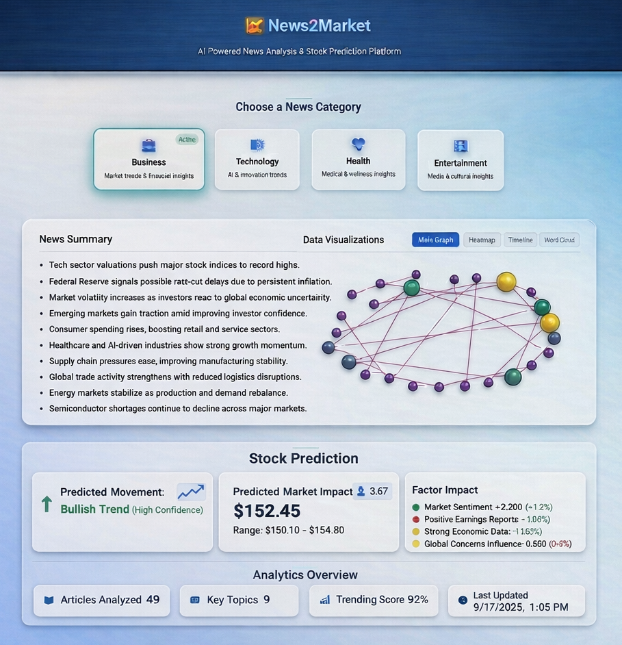

# News2Market 📈📰



**AI-Driven News Intelligence for Financial Market Prediction**


---
# News2Market 📈📰

> **AI-Powered Financial News Analytics & Explainable Stock Direction Prediction**
> A full-stack application that turns financial news into explainable trading signals.


---

## 🎯 Overview

**News2Market** is a full-stack web application that analyzes whether financial news sentiment correlates with short-term stock price movement, and uses Explainable AI (SHAP) to reveal **why** the model makes each prediction.

A user enters a stock ticker (e.g., `AAPL`), and the system:

1. Fetches the latest financial news about that company
2. Runs each article through a finance-specific sentiment model (FinBERT)
3. Fetches recent price data from Yahoo Finance
4. Engineers features combining sentiment signals with technical indicators
5. Trains a Logistic Regression model to predict next-day price direction (up/down)
6. Uses **SHAP** to explain which features (and which specific news articles) drove the prediction
7. Displays everything in an interactive React dashboard

The project is intentionally scoped to be **honest and achievable** — it doesn't claim to beat the market. It claims to demonstrate a complete, explainable ML pipeline from raw news to interpretable predictions.

---

## ❓ Problem Statement

Financial markets react to news in milliseconds. Institutional traders use Bloomberg terminals, paid sentiment feeds, and quant teams to capture this signal. Retail investors, students, and researchers don't have those tools.

But more importantly: **most ML-based stock prediction projects are black boxes**. They claim high accuracy numbers without explaining *why* a model made a given prediction — which is exactly what makes them unusable for real decision-making.

News2Market addresses both:
- **Accessibility:** Uses only free APIs and open-source models
- **Explainability:** Every prediction comes with SHAP-based feature attribution, traceable back to the specific news articles that drove the signal

---

## ✅ What This Project Does

- ✅ Fetches real financial news for any stock ticker (via NewsAPI)
- ✅ Analyzes sentiment using **FinBERT** (a BERT variant fine-tuned on financial text), with **VADER** as a lightweight fallback
- ✅ Pulls real historical price data (via yfinance — free, no API key)
- ✅ Engineers 6 features: average sentiment, article count, sentiment momentum, RSI, volume change, price momentum
- ✅ Trains a Logistic Regression classifier to predict next-day direction
- ✅ Generates SHAP explanations — both global (which features matter overall) and local (per-prediction)
- ✅ Traces each prediction back to the specific news articles that influenced it
- ✅ Stores all results in SQLite for reproducibility
- ✅ Exposes everything through a clean REST API (FastAPI)
- ✅ Displays everything in a typed, modern React dashboard

---

## ❌ What This Project Does NOT Claim

To stay honest, this project explicitly does **not**:

- ❌ Claim to beat the market or generate alpha
- ❌ Use a complex deep learning model (LSTM/Transformer for prediction) — Logistic Regression is intentionally chosen for interpretability
- ❌ Process news in real-time at sub-second latency
- ❌ Run in production with millions of users
- ❌ Replace financial advice in any form

**Realistic accuracy:** Expect ~55-60% directional accuracy on large-cap stocks. That's only modestly better than random (50%), which is the honest truth about sentiment-only prediction models. Hedge funds spend millions to get to that level.

---

## 🏗️ Architecture

```
┌────────────────────────────────────────────────────────────────┐
│                  FRONTEND (Port 5173)                          │
│  React 18 + TypeScript + Vite + Tailwind + Recharts            │
│  ─────────────────────────────────────────────────────         │
│  Pages:    Home, TickerDetail                                  │
│  Components: SearchBar, PriceChart, SentimentCard,             │
│              NewsList, PredictionCard, SHAPPlot                │
└────────────────────────────────────────────────────────────────┘
                          ⇅ REST API (JSON over HTTP)
┌────────────────────────────────────────────────────────────────┐
│                  BACKEND (Port 8000)                           │
│  FastAPI + Pydantic + SQLAlchemy + Uvicorn                     │
│  ─────────────────────────────────────────────────────         │
│  Routers:  /analyze, /news, /sentiment, /predictions, /explain │
│  Auto-generated OpenAPI docs at /docs                          │
└────────────────────────────────────────────────────────────────┘
                          ⇅
┌────────────────────────────────────────────────────────────────┐
│                  ML/NLP PIPELINE (Python)                      │
│  ─────────────────────────────────────────────────────         │
│  1. news_fetcher       → NewsAPI                                │
│  2. sentiment_analyzer → FinBERT (HuggingFace) / VADER          │
│  3. price_fetcher      → yfinance                               │
│  4. feature_engineer   → Pandas/NumPy + technical indicators    │
│  5. predictor          → scikit-learn Logistic Regression       │
│  6. shap_explainer     → SHAP global + local explanations       │
└────────────────────────────────────────────────────────────────┘
                          ⇅
┌────────────────────────────────────────────────────────────────┐
│                  DATABASE (SQLite)                             │
│  Tables: tickers, news_articles, sentiment_scores,             │
│          price_data, analysis_runs, predictions, shap_values   │
└────────────────────────────────────────────────────────────────┘
```

---

## 🛠️ Tech Stack

### Frontend
| Technology | Purpose |
|-----------|---------|
| **React 18** | UI framework |
| **TypeScript 5** | Type safety |
| **Vite** | Build tool (fast HMR) |
| **Tailwind CSS** | Utility-first styling |
| **Recharts** | Interactive charts |
| **Axios** | HTTP client |
| **React Router** | Client-side routing |

### Backend
| Technology | Purpose |
|-----------|---------|
| **Python 3.10+** | Backend language |
| **FastAPI** | Async REST API framework |
| **Pydantic** | Schema validation |
| **SQLAlchemy** | ORM |
| **SQLite** | Embedded database |
| **Uvicorn** | ASGI server |

### Machine Learning & NLP
| Technology | Purpose |
|-----------|---------|
| **Hugging Face Transformers** | Loads FinBERT model |
| **FinBERT** (`ProsusAI/finbert`) | Financial sentiment classification |
| **VADER** | Lightweight fallback sentiment model |
| **PyTorch** | Deep learning backend for FinBERT |
| **scikit-learn** | Logistic Regression model |
| **SHAP** | Feature attribution & explainability |
| **pandas, NumPy** | Data manipulation |
| **yfinance** | Yahoo Finance market data |

### Data Sources
| Source | Cost | Purpose |
|--------|------|---------|
| **NewsAPI** | Free tier (100 req/day) | Financial news articles |
| **yfinance** | Free, no API key | Historical OHLCV stock data |

---

## 🔄 How It Works — End-to-End Flow

When a user requests analysis for ticker `AAPL`, the system runs the following 6-stage pipeline:

### Stage 1: News Fetching
- **Module:** `services/news_fetcher.py`
- Queries NewsAPI for articles mentioning "AAPL" or "Apple Inc" from the last N days (default 30)
- Stores articles in `news_articles` table with headline, content, URL, source, and timestamp

### Stage 2: Sentiment Analysis
- **Module:** `services/sentiment_analyzer.py`
- Each article is passed through FinBERT (or VADER, based on flag)
- Returns positive / negative / neutral probability scores
- A compound score in [-1, +1] is computed for downstream use
- Stored in `sentiment_scores` table linked to each article

### Stage 3: Price Data Fetching
- **Module:** `services/price_fetcher.py`
- yfinance pulls daily OHLCV data for the same date range
- Stored in `price_data` table

### Stage 4: Feature Engineering
- **Module:** `services/feature_engineering.py`
- Aligns news (which may have multiple per day) with daily price bars
- Computes 6 features for each trading day:
  - `avg_sentiment` — mean compound sentiment across that day's articles
  - `article_count` — number of news articles that day
  - `sentiment_momentum` — change in sentiment vs previous day
  - `rsi_14` — 14-day Relative Strength Index
  - `volume_change` — % change in trading volume
  - `price_momentum_5d` — 5-day price momentum
- Target label: `direction` (1 if next-day close > today's close, else 0)

### Stage 5: Prediction
- **Module:** `services/predictor.py`
- Splits data chronologically (80% train / 20% test) — no shuffle, to avoid look-ahead bias
- Trains a Logistic Regression model
- Evaluates accuracy and outputs probability for the next prediction
- Stores predictions in `predictions` table

### Stage 6: Explainability
- **Module:** `services/shap_explainer.py`
- Uses SHAP `LinearExplainer` (efficient for logistic regression)
- Computes global feature importance — which features drive predictions overall
- Computes per-prediction SHAP values — exact contribution of each feature for any single prediction
- For sentiment-driven predictions, traces back to the top contributing news articles
- Stored in `shap_values` table

The orchestrator (`services/pipeline.py`) runs all 6 stages in sequence and returns a structured response to the frontend.

---

## 🗄️ Database Schema

SQLite, managed via SQLAlchemy ORM. Schema is auto-created on first run.

```
┌─────────────────────┐
│ tickers             │
├─────────────────────┤
│ id (PK)             │
│ symbol (unique)     │
│ company_name        │
│ created_at          │
└─────────────────────┘
         │ 1
         │
         │ N
┌─────────────────────┐         ┌──────────────────────┐
│ news_articles       │  1   N  │ sentiment_scores     │
├─────────────────────┤◄────────┤──────────────────────┤
│ id (PK)             │         │ id (PK)              │
│ ticker_id (FK)      │         │ article_id (FK)      │
│ headline            │         │ model_used           │
│ content             │         │ positive_score       │
│ url                 │         │ negative_score       │
│ source              │         │ neutral_score        │
│ published_at        │         │ compound_score       │
│ fetched_at          │         │ label                │
└─────────────────────┘         └──────────────────────┘

┌─────────────────────┐         ┌──────────────────────┐
│ price_data          │         │ analysis_runs        │
├─────────────────────┤         ├──────────────────────┤
│ id (PK)             │         │ id (PK)              │
│ ticker_id (FK)      │         │ ticker_id (FK)       │
│ date                │         │ run_at               │
│ open, high, low,    │         │ days_analyzed        │
│ close, volume       │         │ correlation_score    │
└─────────────────────┘         │ accuracy             │
                                │ sentiment_model      │
                                └──────────────────────┘
                                         │ 1
                                         │ N
                                ┌──────────────────────┐
                                │ predictions          │
                                ├──────────────────────┤
                                │ id (PK)              │
                                │ run_id (FK)          │
                                │ date                 │
                                │ predicted_direction  │
                                │ confidence           │
                                │ actual_direction     │
                                └──────────────────────┘
                                         │ 1
                                         │ N
                                ┌──────────────────────┐
                                │ shap_values          │
                                ├──────────────────────┤
                                │ id (PK)              │
                                │ prediction_id (FK)   │
                                │ feature_name         │
                                │ shap_value           │
                                │ feature_value        │
                                └──────────────────────┘
```

---

## 📡 API Reference

Full interactive docs auto-generated at `http://localhost:8000/docs` when the backend is running.

### Endpoints

| Method | Endpoint | Description |
|--------|----------|-------------|
| `GET` | `/api/health` | Health check |
| `POST` | `/api/analyze/{ticker}` | Run the full pipeline for a ticker |
| `GET` | `/api/news/{ticker}` | Latest news for a ticker |
| `GET` | `/api/sentiment/{ticker}` | Aggregated sentiment scores |
| `GET` | `/api/predictions/{ticker}` | Latest predictions for a ticker |
| `GET` | `/api/explain/{ticker}` | SHAP explanations (global + local) |

### Example: Analyze Request

```http
POST /api/analyze/AAPL?days=30&model=finbert
```

### Example: Analyze Response

```json
{
  "ticker": "AAPL",
  "company_name": "Apple Inc.",
  "analysis_date": "2026-05-15T10:30:00Z",
  "days_analyzed": 30,
  "articles_analyzed": 142,
  "model_used": "finbert",
  "sentiment_summary": {
    "positive": 0.58,
    "negative": 0.21,
    "neutral": 0.21,
    "avg_compound": 0.34
  },
  "prediction": {
    "date": "2026-05-16",
    "predicted_direction": "up",
    "confidence": 0.67
  },
  "model_metrics": {
    "test_accuracy": 0.58,
    "sentiment_price_correlation": 0.21,
    "train_size": 24,
    "test_size": 6
  },
  "shap_global": [
    { "feature": "avg_sentiment", "importance": 0.34 },
    { "feature": "rsi_14", "importance": 0.22 },
    { "feature": "price_momentum_5d", "importance": 0.18 },
    { "feature": "sentiment_momentum", "importance": 0.12 },
    { "feature": "volume_change", "importance": 0.08 },
    { "feature": "article_count", "importance": 0.06 }
  ],
  "shap_local": [
    { "feature": "avg_sentiment", "value": 0.42, "shap_value": 0.31 },
    { "feature": "rsi_14", "value": 58.3, "shap_value": 0.18 },
    { "feature": "price_momentum_5d", "value": 0.024, "shap_value": 0.09 },
    { "feature": "sentiment_momentum", "value": 0.08, "shap_value": 0.04 },
    { "feature": "volume_change", "value": -0.05, "shap_value": -0.03 },
    { "feature": "article_count", "value": 8, "shap_value": 0.02 }
  ],
  "top_influential_articles": [
    {
      "headline": "Apple reports record Q1 revenue, beats expectations",
      "source": "Reuters",
      "sentiment_score": 0.78,
      "published_at": "2026-05-14T15:00:00Z"
    }
  ]
}
```

---

## 📁 Project Structure

```
News2Market/
├── backend/
│   ├── app/
│   │   ├── __init__.py
│   │   ├── main.py                    # FastAPI entry point
│   │   ├── config.py                  # Settings (env vars)
│   │   ├── database.py                # SQLAlchemy session setup
│   │   ├── models.py                  # SQLAlchemy ORM models
│   │   ├── schemas.py                 # Pydantic request/response schemas
│   │   ├── routers/
│   │   │   ├── analyze.py             # POST /api/analyze/{ticker}
│   │   │   ├── news.py                # GET /api/news/{ticker}
│   │   │   ├── sentiment.py           # GET /api/sentiment/{ticker}
│   │   │   ├── predictions.py         # GET /api/predictions/{ticker}
│   │   │   └── explain.py             # GET /api/explain/{ticker}
│   │   └── services/
│   │       ├── news_fetcher.py        # NewsAPI client
│   │       ├── sentiment_analyzer.py  # FinBERT + VADER
│   │       ├── price_fetcher.py       # yfinance wrapper
│   │       ├── feature_engineering.py # Feature matrix builder
│   │       ├── predictor.py           # Logistic Regression
│   │       ├── shap_explainer.py      # SHAP global + local
│   │       └── pipeline.py            # End-to-end orchestrator
│   ├── tests/
│   │   ├── test_sentiment.py
│   │   └── test_pipeline.py
│   ├── requirements.txt
│   ├── .env.example
│   └── news2market.db                 # SQLite file (auto-created)
│
├── frontend/
│   ├── src/
│   │   ├── main.tsx                   # React entry point
│   │   ├── App.tsx                    # Root component + routing
│   │   ├── index.css                  # Tailwind imports
│   │   ├── types/
│   │   │   └── index.ts               # TypeScript interfaces
│   │   ├── api/
│   │   │   └── client.ts              # Axios instance + API functions
│   │   ├── hooks/
│   │   │   └── useAnalysis.ts         # Custom hook for analysis state
│   │   ├── pages/
│   │   │   ├── Home.tsx               # Landing page with search
│   │   │   └── TickerDetail.tsx       # Full analysis view
│   │   └── components/
│   │       ├── SearchBar.tsx          # Ticker input
│   │       ├── PriceChart.tsx         # Recharts price chart
│   │       ├── SentimentCard.tsx      # Sentiment summary
│   │       ├── NewsList.tsx           # Article list with sentiment
│   │       ├── PredictionCard.tsx     # Prediction + confidence
│   │       ├── SHAPPlot.tsx           # Global + local SHAP viz
│   │       └── LoadingSpinner.tsx
│   ├── public/
│   ├── index.html
│   ├── package.json
│   ├── tsconfig.json
│   ├── vite.config.ts
│   ├── tailwind.config.js
│   ├── postcss.config.js
│   └── .env.example
│
├── README.md                          # This file
├── INTERVIEW_NOTES.md                 # Q&A prep for interviews
├── ARCHITECTURE.md                    # Deeper system design notes
└── .gitignore
```

---

## 🚀 Installation & Setup

### Prerequisites

- **Python 3.10+**
- **Node.js 18+** and npm
- A **NewsAPI key** (free at [newsapi.org](https://newsapi.org/) — sign up)

### 1. Clone the repository

```bash
git clone https://github.com/L-ikitha/News2Market.git
cd News2Market
```

### 2. Backend setup

```bash
cd backend

# Create virtual environment
python -m venv venv

# Activate it
source venv/bin/activate          # Mac/Linux
venv\Scripts\activate              # Windows

# Install dependencies
pip install -r requirements.txt

# Configure environment
cp .env.example .env
# Edit .env and add: NEWSAPI_KEY=your_key_here
```

### 3. Frontend setup

```bash
cd ../frontend

# Install dependencies
npm install

# Configure environment
cp .env.example .env
# Default backend URL: VITE_API_URL=http://localhost:8000
```

---

## ▶️ Running the Project

You need **two terminals running simultaneously**.

### Terminal 1 — Backend

```bash
cd backend
source venv/bin/activate
uvicorn app.main:app --reload
```

Backend live at: `http://localhost:8000`
Interactive API docs: `http://localhost:8000/docs`

### Terminal 2 — Frontend

```bash
cd frontend
npm run dev
```

Frontend live at: `http://localhost:5173`

Open the frontend URL in your browser, search for a ticker (e.g., `AAPL`, `MSFT`, `TSLA`), and watch the pipeline run.

---

## 📊 Example Usage

### Via the Web UI

1. Open `http://localhost:5173`
2. Enter a ticker: `AAPL`
3. Click "Analyze"
4. Wait ~30-60 seconds (FinBERT model loads on first run)
5. View:
   - Price chart with sentiment overlay
   - Sentiment breakdown (positive/negative/neutral)
   - List of analyzed news articles
   - Prediction card with confidence
   - SHAP plots — global feature importance + local explanation
   - Top 3 most influential news articles for the prediction

### Via the API directly

```bash
# Run full analysis
curl -X POST "http://localhost:8000/api/analyze/AAPL?days=30&model=finbert"

# Get latest news
curl "http://localhost:8000/api/news/AAPL"

# Get sentiment summary
curl "http://localhost:8000/api/sentiment/AAPL"

# Get SHAP explanations
curl "http://localhost:8000/api/explain/AAPL"
```

---

## 📊 Realistic Results & Expectations

These are **honest, real-world numbers** you should expect, not inflated marketing claims:

| Metric | Expected Range | Notes |
|--------|---------------|-------|
| **FinBERT sentiment F1** | ~85% | On Financial PhraseBank benchmark |
| **Prediction accuracy** | **55-60%** | Honestly modest, but realistic for sentiment-only |
| **Sentiment–price correlation** | 0.15 – 0.30 | Weak positive correlation for liquid stocks |
| **Pipeline runtime (first run)** | ~60-90 sec | FinBERT model loads (~400MB) |
| **Pipeline runtime (subsequent)** | ~10-20 sec | Model cached |
| **Articles analyzed per run** | 50 – 150 | Depends on NewsAPI free-tier limits |

> **Why is 55-60% accuracy a good result?** Because **50% is random**, and beating random consistently with a transparent, interpretable model is the actual challenge. Hedge funds spend millions to beat random by a few percent.

---

## 🧠 Explainable AI (SHAP)

This is the **core differentiator** of this project. Every prediction comes with two layers of explanation:

### Global Explanation

Across all predictions, **which features matter most?**

Example output:
```
avg_sentiment          ████████████ 34%
rsi_14                 ████████     22%
price_momentum_5d      ██████       18%
sentiment_momentum     ████         12%
volume_change          ███          8%
article_count          ██           6%
```

### Local Explanation (Per Prediction)

For a single "up" prediction on May 16:
- `avg_sentiment = 0.42` → contributed **+0.31** to "up" probability
- `rsi_14 = 58.3` → contributed **+0.18** to "up" probability
- `volume_change = -0.05` → contributed **-0.03** (slight bearish pull)

### Article-Level Attribution

Because we know which articles drove the day's `avg_sentiment`, we can trace back to the **top 3 most influential headlines** for any prediction. This is what makes the system genuinely auditable.

---

## ⚠️ Limitations & Honest Disclosures

This is an **educational project**. Read these carefully before drawing any conclusions:

- **Not financial advice.** Do not trade real money based on this system's output.
- **Small dataset.** A 30-day window has only ~20 trading days, which is too small for robust ML. Real systems use months/years of data.
- **Look-ahead bias risk.** We use strict chronological splits, but news fetch timestamps can introduce subtle leakage.
- **NewsAPI free-tier limits.** 100 requests/day and 30-day historical limit constrain real-world use.
- **English-only.** FinBERT is trained on English financial text.
- **No after-hours / pre-market data.** yfinance gives daily bars only.
- **Survivorship bias.** Only tickers that still exist can be analyzed.
- **Sentiment ≠ causation.** Correlation between sentiment and price does not mean sentiment *causes* price moves.

---

## 🗺️ Future Roadmap

- [ ] Add VADER vs FinBERT comparison view in the UI
- [ ] Backtest module with portfolio simulation
- [ ] Multi-ticker comparison dashboard
- [ ] Replace SQLite with PostgreSQL for production
- [ ] Containerize with Docker for one-command setup
- [ ] Deploy demo to Hugging Face Spaces (free)
- [ ] Add Reddit/StockTwits as additional sentiment sources
- [ ] Replace Logistic Regression with XGBoost (with SHAP TreeExplainer)
- [ ] Add unit & integration test coverage to 80%+

--

## 👤 Author

**L-ikitha**
GitHub: [@L-ikitha](https://github.com/L-ikitha)
Project: [News2Market](https://github.com/L-ikitha/News2Market)

---

## 🙏 Acknowledgments

- [ProsusAI](https://huggingface.co/ProsusAI/finbert) for the FinBERT model
- [Hugging Face](https://huggingface.co/) for the Transformers library
- [SHAP](https://github.com/shap/shap) for the explainability framework
- [NewsAPI](https://newsapi.org/) for free financial news access
- [yfinance](https://github.com/ranaroussi/yfinance) for free market data
- [FastAPI](https://fastapi.tiangolo.com/) for the elegant web framework

---
