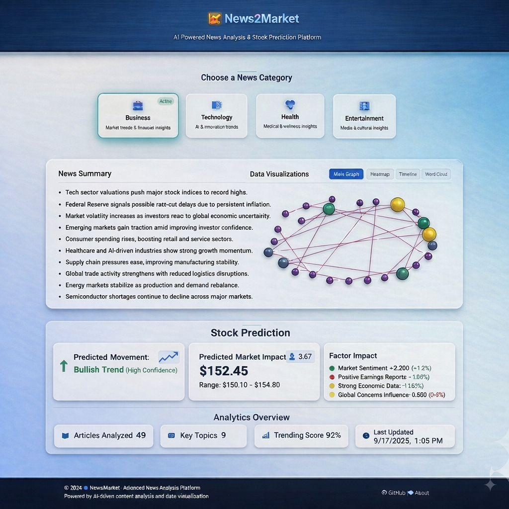

# News2Market 📈📰



**AI-Driven News Intelligence for Financial Market Prediction**


---
From headlines → signals → predictions → decisions.
---

## 🎯 Objectives

* Automate large-scale news ingestion
* Extract semantic meaning from news using NLP
* Correlate sentiment with financial markets
* Predict stock price movements
* Provide explainable AI-driven financial insights

---

## ✨ Features

### 🧠 AI & NLP Intelligence

* Abstractive news summarization
* Topic classification across multiple sectors
* Named Entity Recognition (companies, people, locations)
* Graph-based relationship modeling between topics and entities
* Sentiment scoring and polarity analysis

### 📈 Financial Intelligence

* Historical & real-time stock data ingestion
* Feature engineering for financial indicators
* News–sentiment–price correlation modeling
* ML-based stock trend prediction
* Risk signal extraction
* Explainable AI using SHAP

### 📊 Visualization

* Interactive dashboards
* Entity relationship networks
---

## 🛠️ Core Technologies

### 🔹 Programming & Data

* **Python 3.8+** – Main programming language
* **Pandas** – Data manipulation & preprocessing
* **NumPy** – Numerical computing

### 🤖 NLP & AI

* **Transformers (Hugging Face)** – State-of-the-art NLP models
* **SpaCy** – Named Entity Recognition & linguistic pipelines
* **PyTorch** – Deep learning framework

### 📊 Visualization & Graph Analytics

* **Plotly** – Interactive visualizations
* **NetworkX** – Graph analysis and visualization
* **Matplotlib** – Statistical plotting

### 📈 Stock Prediction Technologies

* **Feature Engineering Engine** – Custom signal extraction (sentiment index, volatility signals, trend indicators)
* **Historical Market Data Fetcher** – Automated stock data ingestion
* **Time-Series Modeling Techniques** – Market movement modeling
* **Supervised ML Models** – Trend classification & regression prediction
* **Correlation Analysis Models** – News sentiment vs price movement mapping
* **Explainable AI (SHAP)** – Transparent financial predictions

---

## 📁 Project Structure

```
.
├── app/                    # Frontend UI
│   ├── index.html
│   ├── script.js
│   └── style.css
├── main.py
├── run.py
├── setup.py
├── requirements.txt
└── src/
    ├── core/               # NLP pipeline
    │   ├── content_extractor.py
    │   ├── news_crawler.py
    │   ├── summarizer.py
    │   ├── topic_classifier.py
    │   ├── topic_clusterer.py
    │   ├── graph_summarizer.py
    │   └── result_display.py
    ├── finance/            # Financial modeling
    │   ├── stock_data_fetcher.py
    │   ├── feature_engineering.py
    │   └── stock_prediction.py
    ├── explainability/     # XAI
    │   └── shap_explainer.py
    ├── utils/
    │   ├── config.py
    │   └── progress.py
    └── pipeline.py         # End-to-end orchestration
```

---

## 🚀 Installation

### 1. Clone Repository

```bash
git clone https://github.com/L-ikitha/News2Market.git
cd News2Market
```

### 2. Virtual Environment

```bash
python -m venv venv
source venv/bin/activate        # Mac/Linux
venv\Scripts\activate           # Windows
```

### 3. Install Dependencies

```bash
pip install -r requirements.txt
```

---

## 🤖 Model Setup

```bash
# SpaCy model
python -m spacy download en_core_web_sm
```

## ▶️ Run Project

```bash
python main.py
```

---

## 📌 Use Cases

* Algorithmic trading research
* Financial sentiment analysis
* Market forecasting systems
* Quantitative finance research
* Risk modeling
* Investment strategy optimization
* Economic impact analysis

---

## 🔮 Future Roadmap

* Real-time news streaming (Kafka)
* Multi-language NLP support
* Crypto & forex market integration
* Reinforcement learning trading agents
* Portfolio optimization engine
* Cloud deployment (Docker + Kubernetes)
* API-based market intelligence services

